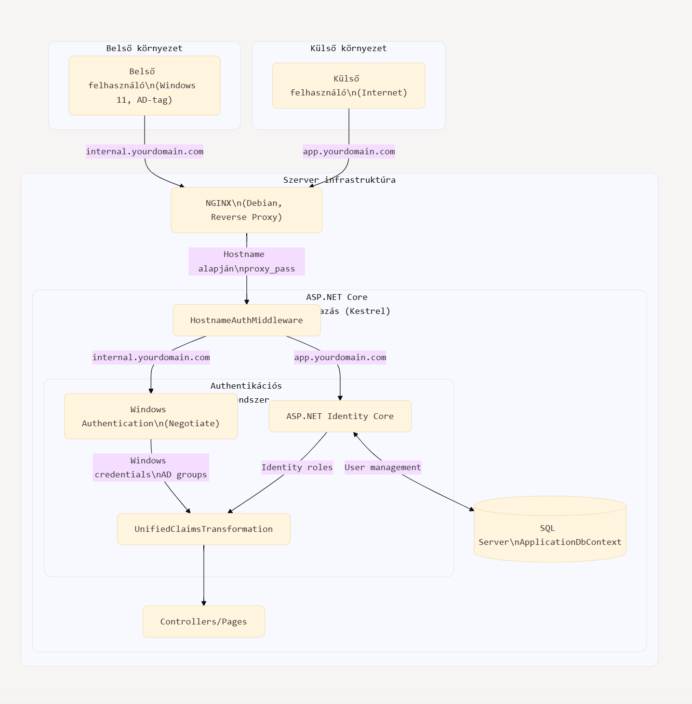

## hybrid-auth koncepció

Az alábbi megoldás SSO módon mködik, azaz Windows felhasználók esetén nem kér további azonosítást, hanem automatikusan bejelentkezteti őket a rendszerbe. Külső felhasználók esetén ASP.NET Identity Core-t használ a hitelesítésre, de a jogosultságok kezelése egységesített, lásd alább.

Egyszerbb is, mert nincsen LDAP kommunikáció, a belső userek esetén a browser küldi a Windows hitelesítési adatokat a header-ben.

A domain név alapján történő elágazás helyett használhatunk mást is pl url path, vagy IP cím, vagy bármi, amit a HTTP kérésből ki lehet olvasni. A legbiztonságosabb és tisztább megoldás szerintem a hostname.

Fontosabb pontok a kódban, megjelölve // NOTE kommenttel:

Dislaimer: POC-olni kell a kódot, mert nem teszteltem, de a koncepciót leírja. (azaz a papír mindent elbír)

## Ábra:

- **Környezetek**:
  - Külső környezet: Internetről érkező felhasználói kérések kezelése
  - Belső környezet: Windows 10/11 operációs rendszerrel, Active Directory tagsággal rendelkező felhasználók
  - Szerver infrastruktúra: Az alkalmazás teljes kiszolgálói oldali architektúrája
- **Domain nevek (host header-ben)**:
  - Belső felhasználók az `internal.yourdomain.com` címen keresztül érik el a rendszert
  - Külső felhasználók az `app.yourdomain.com` címen keresztül férnek hozzá
  - Először az NGINX reverse proxy-n keresztül halad
- **Hitelesítési logika**:
  - A HostnameAuthMiddleware irányítja a request-et a megfelelő hitelesítési útvonalra
  - Belső kérések esetén Windows Authentication kerül használatra
  - (ilyenkor első körben HTTP 401 Unauthorized választ kap a kliens, majd a böngésző automatikusan elküldi a Windows hitelesítési adatokat a host headerben: `Authorization...)
  - Külső kéréseknél ASP.NET Identity Core biztosítja a hitelesítést
  - Hitelesítési módszertől függetlenül, az effectív jodosultágokat a UnifiedClaimsTransformation-ben hozzug egysége formára, az App további részei számára transzparens módon
- **Adatkezelés**:
  - A transformált jogcímek (claims) elérhetővé válnak a Controller réteg számára



## Program.cs

```csharp
// Program.cs

using Microsoft.AspNetCore.Authentication;
using Microsoft.AspNetCore.Authentication.Negotiate;
using Microsoft.AspNetCore.Identity;
using Microsoft.EntityFrameworkCore;
using Microsoft.Extensions.DependencyInjection;

public class Program
{
    public static void Main(string[] args)
    {
        var builder = WebApplication.CreateBuilder(args);

        // Konfiguráció beállítása
        // NOTE:
        var internalHostname = builder.Configuration["Authentication:InternalHostname"]; // pl. "internal.yourdomain.com"
        var externalHostname = builder.Configuration["Authentication:ExternalHostname"]; // pl. "app.yourdomain.com"

        // DbContext konfigurálása Identity számára
        builder.Services.AddDbContext<ApplicationDbContext>(options =>
            options.UseSqlServer(builder.Configuration.GetConnectionString("DefaultConnection")));

        // ASP.NET Identity Core hozzáadása
        builder.Services.AddIdentity<ApplicationUser, IdentityRole>(options => {
                options.SignIn.RequireConfirmedAccount = true;
                options.Password.RequiredLength = 8;
                // További Identity beállítások...
            })
            .AddEntityFrameworkStores<ApplicationDbContext>()
            .AddDefaultTokenProviders();

        // Windows Authentication beállítása
        builder.Services.AddAuthentication()
            .AddNegotiate("Windows", options => {
                options.Events = new NegotiateEvents
                {
                    OnAuthenticated = context => {
                        // AD-ből származó claim-ek hozzáadása
                        var claims = new List<Claim>
                        {
                            new Claim(ClaimTypes.AuthenticationMethod, "Windows"),
                            // További claim-ek hozzáadhatók az AD-ből
                        };
                        context.Principal.AddIdentity(new ClaimsIdentity(claims));
                        return Task.CompletedTask;
                    }
                };
            });

        // Cookie beállítások
        builder.Services.ConfigureApplicationCookie(options => {
            options.Cookie.Name = "YourApp.Auth";
            options.LoginPath = "/Account/Login";
            options.LogoutPath = "/Account/Logout";
            options.AccessDeniedPath = "/Account/AccessDenied";
            options.Cookie.HttpOnly = true;
            options.ExpireTimeSpan = TimeSpan.FromDays(1);
            options.SlidingExpiration = true;
        });

        // Egységes jogosultságkezelési rendszer beállítása
        builder.Services.AddAuthorization(options => {
            // Alapértelmezett policy minden hitelesített felhasználó számára
            options.DefaultPolicy = new AuthorizationPolicyBuilder()
                .RequireAuthenticatedUser()
                .Build();

            // Admin role policy
            options.AddPolicy("AdminOnly", policy =>
                policy.RequireRole("Admin"));

            // Egyedi policy, ami mindkét rendszerből fogad claim-eket
            options.AddPolicy("CanManageUsers", policy =>
                policy.RequireAssertion(context =>
                    context.User.HasClaim(c => c.Type == "ManageUsers" && c.Value == "true") ||
                    context.User.IsInRole("Admin")));
        });

        // Claim Transzformáció beállítása a Windows és Identity claim-ek közötti egységesítéshez
        builder.Services.AddSingleton<IClaimsTransformation, UnifiedClaimsTransformation>();

        builder.Services.AddControllersWithViews();
        builder.Services.AddRazorPages();

        var app = builder.Build();

        // HTTP pipeline konfigurálása
        if (app.Environment.IsDevelopment())
        {
            app.UseDeveloperExceptionPage();
        }
        else
        {
            app.UseExceptionHandler("/Home/Error");
            app.UseHsts();
        }

        app.UseHttpsRedirection();
        app.UseStaticFiles();
        app.UseRouting();

        // Hostname alapú hitelesítés middleware
        app.UseMiddleware<HostnameAuthMiddleware>();

        app.UseAuthentication();
        app.UseAuthorization();

        app.MapControllerRoute(
            name: "default",
            pattern: "{controller=Home}/{action=Index}/{id?}");
        app.MapRazorPages();

        app.Run();
    }
}
```

## Egyedi entitás az Identity-hez -> IsExternal

```csharp
// Egyedi entitás az Identity-hez
public class ApplicationUser : IdentityUser
{
    public string FirstName { get; set; }
    public string LastName { get; set; }
    // NOTE:
    // Ez itt a lényeg-> külső vagy belső hitelesítés:
    public bool IsExternal { get; set; } = true;
    // További felhasználói tulajdonságok...
}
```

## Auth Middleware, választ a hitelesítési módtól függően, lehet domain, url path, IP cím, stb.

```csharp
// Hostname alapú hitelesítés middleware
// ...de hasonló logikával lehetne más is a megkülönböztető jel, pl. URL path, vagy IP cím,
// vagy bármi, amit a HTTP kérésből ki lehet olvasni. A legbiztonságosabb és tisztább megoldás szerintem a hostname
// NOTE:
public class HostnameAuthMiddleware
{
    private readonly RequestDelegate _next;
    private readonly string _internalHostname;
    private readonly string _externalHostname;

    public HostnameAuthMiddleware(
        RequestDelegate next,
        IConfiguration configuration)
    {
        _next = next;
        _internalHostname = configuration["Authentication:InternalHostname"];
        _externalHostname = configuration["Authentication:ExternalHostname"];
    }

    public async Task InvokeAsync(HttpContext context)
    {
        // Már hitelesített felhasználó?
        if (context.User.Identity.IsAuthenticated)
        {
            await _next(context);
            return;
        }

        var host = context.Request.Host.Host.ToLower();

        // Hostname alapján döntünk a hitelesítési módról
        if (host == _internalHostname)
        {
            // Belső felhasználók -> Windows Auth
            var windowsResult = await context.AuthenticateAsync("Windows");
            if (!windowsResult.Succeeded)
            {
                await context.ChallengeAsync("Windows");
                return;
            }
        }
        else if (host == _externalHostname)
        {
            // Külső felhasználók -> ASP.NET Identity
            // Mivel az Identity automatikusan átirányít a bejelentkezési oldalra,
            // itt nem kell külön logika, a cookie auth middleware kezeli
        }
        else
        {
            // NOTE:
            // Ismeretlen hostname, default policy
            // Itt dönthetünk default viselkedésről vagy hibaüzenetről
            // Jellemzően 403,  és logolás, alert a rendszergazdának, stb
        }

        await _next(context);
    }
}
```

## Claimek egységesítése:

```csharp
// Claims Transzformáció az egységes jogosultságkezeléshez
public class UnifiedClaimsTransformation : IClaimsTransformation
{
    private readonly UserManager<ApplicationUser> _userManager;
    private readonly IConfiguration _configuration;

    public UnifiedClaimsTransformation(
        UserManager<ApplicationUser> userManager,
        IConfiguration configuration)
    {
        _userManager = userManager;
        _configuration = configuration;
    }

    // NOTE:
    public async Task<ClaimsPrincipal> TransformAsync(ClaimsPrincipal principal)
    {
        // Ha nem autentikált, nincs mit transzformálni
        if (!principal.Identity.IsAuthenticated)
            return principal;

        // Új ClaimsIdentity a meglévő klónozásával
        var clone = principal.Clone();
        var newIdentity = clone.Identity as ClaimsIdentity;

        // Windows Auth esetén
        if (principal.Identity.AuthenticationType == "Negotiate")
        {
            // 1. Ellenőrizzük, létezik-e a felhasználó az ASP.NET Identity adatbázisban
            var windowsUsername = principal.Identity.Name;
            var user = await _userManager.FindByNameAsync(windowsUsername);

            if (user == null)
            {
                // Opcionálisan létrehozhatjuk a felhasználót automatikusan
                user = new ApplicationUser
                {
                    UserName = windowsUsername,
                    Email = $"{windowsUsername.Replace("\\", ".")}@{_configuration["Domain:Name"]}",
                    EmailConfirmed = true,
                    IsExternal = false
                };
                await _userManager.CreateAsync(user);
            }

            // 2. AD groupok lekérdezése és átalakítása szerepkörökké
            var windowsIdentity = WindowsIdentity.GetCurrent();
            if (windowsIdentity != null)
            {
                var groups = windowsIdentity.Groups;
                foreach (var group in groups)
                {
                    var groupName = group.Translate(typeof(NTAccount)).Value;

                    // Adminisztrátorok kezelése
                    if (groupName.EndsWith("Domain Admins") || groupName.EndsWith("Administrators"))
                    {
                        newIdentity.AddClaim(new Claim(ClaimTypes.Role, "Admin"));
                    }

                    // Egyéb AD csoport - szerepkör leképezések
                    if (groupName.EndsWith("UserManagers"))
                    {
                        newIdentity.AddClaim(new Claim("ManageUsers", "true"));
                    }

                    // Itt további group -> role vagy group -> claim leképezés
                }
            }

            // Hozzáadjuk a forrást jelző claim-et
            newIdentity.AddClaim(new Claim("AuthSource", "Windows"));
        }
        else
        {
            // ASP.NET Identity esetén - már megvannak a szerepkörök
            // De hozzáadjuk a forrást jelző claim-et
            newIdentity.AddClaim(new Claim("AuthSource", "Identity"));
        }

        return clone;
    }
}


```

## Vonatkozó NGINX beállítások (https átírányítással + certificate-ekkel, de nem ez a lényeg)

```
# /etc/nginx/sites-available/webapp.conf

# Belső felhasználók számára (Windows Authentication)
server {
    listen 80;
    server_name internal.yourdomain.com;

    # HTTPS átirányítás
    return 301 https://$host$request_uri;
}

server {
    listen 443 ssl;
    server_name internal.yourdomain.com;

    # SSL beállítások
    ssl_certificate     /path/to/internal_cert.crt;
    ssl_certificate_key /path/to/internal_private.key;

    # Proxy beállítások
    location / {
        proxy_pass http://localhost:5000;
        proxy_http_version 1.1;
        proxy_set_header Upgrade $http_upgrade;
        proxy_set_header Connection keep-alive;
        proxy_set_header Host $host;
        proxy_cache_bypass $http_upgrade;
        proxy_set_header X-Forwarded-For $proxy_add_x_forwarded_for;
        proxy_set_header X-Forwarded-Proto $scheme;

        # Windows authentication headerek továbbítása
        proxy_set_header Authorization $http_authorization;
        proxy_pass_header Authorization;
    }
}

# Külső felhasználók számára (ASP.NET Identity)
server {
    listen 80;
    server_name app.yourdomain.com;

    # HTTPS átirányítás
    return 301 https://$host$request_uri;
}

server {
    listen 443 ssl;
    server_name app.yourdomain.com;

    # SSL beállítások
    ssl_certificate     /path/to/external_cert.crt;
    ssl_certificate_key /path/to/external_private.key;

    # Proxy beállítások
    location / {
        proxy_pass http://localhost:5000;
        proxy_http_version 1.1;
        proxy_set_header Upgrade $http_upgrade;
        proxy_set_header Connection keep-alive;
        proxy_set_header Host $host;
        proxy_cache_bypass $http_upgrade;
        proxy_set_header X-Forwarded-For $proxy_add_x_forwarded_for;
        proxy_set_header X-Forwarded-Proto $scheme;
    }
}
```
